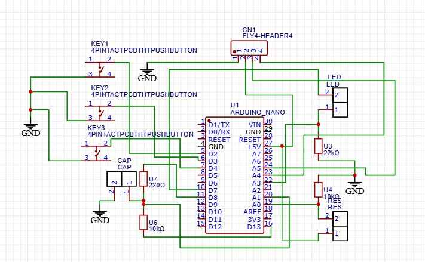
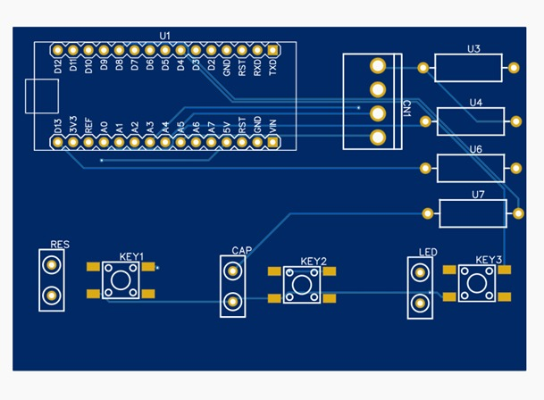
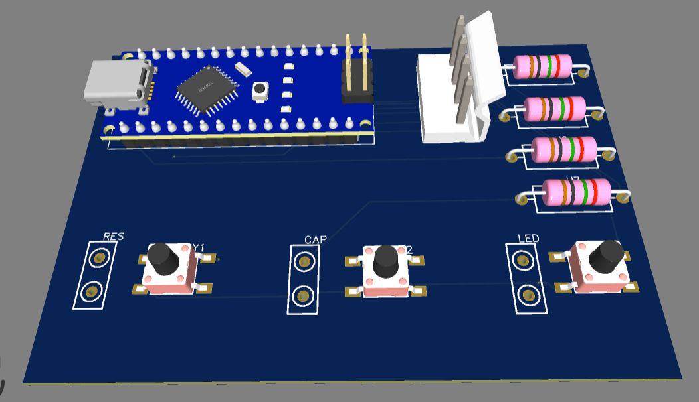
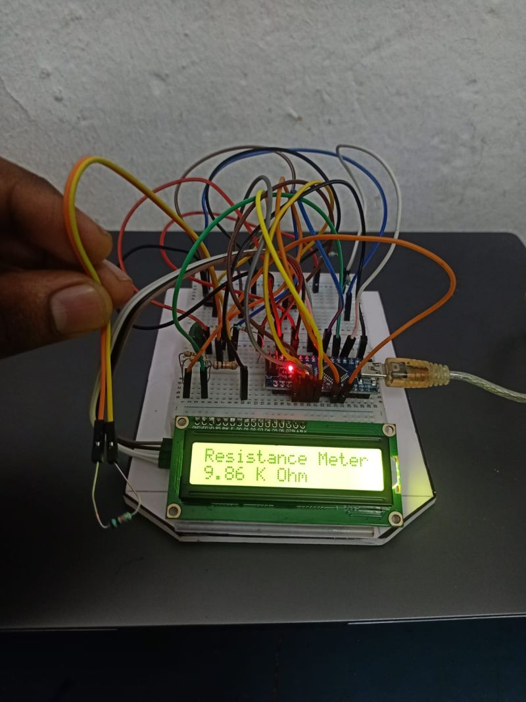
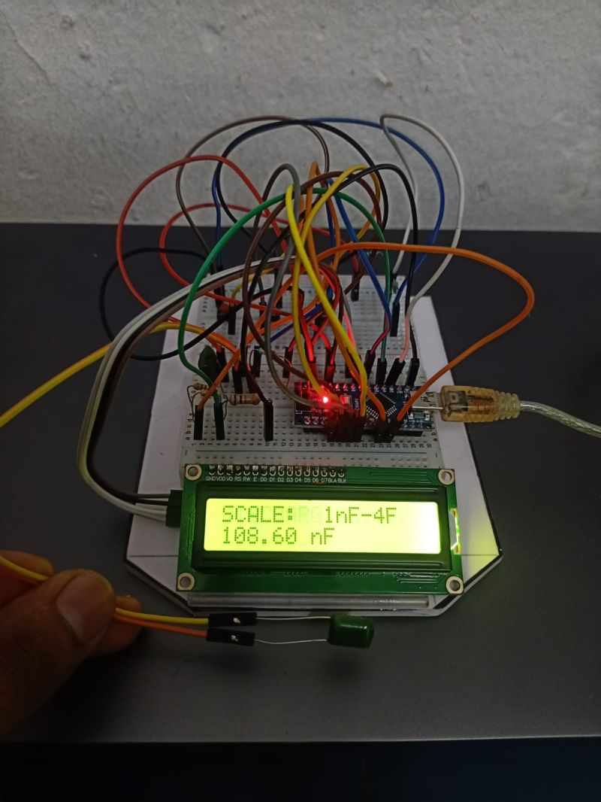
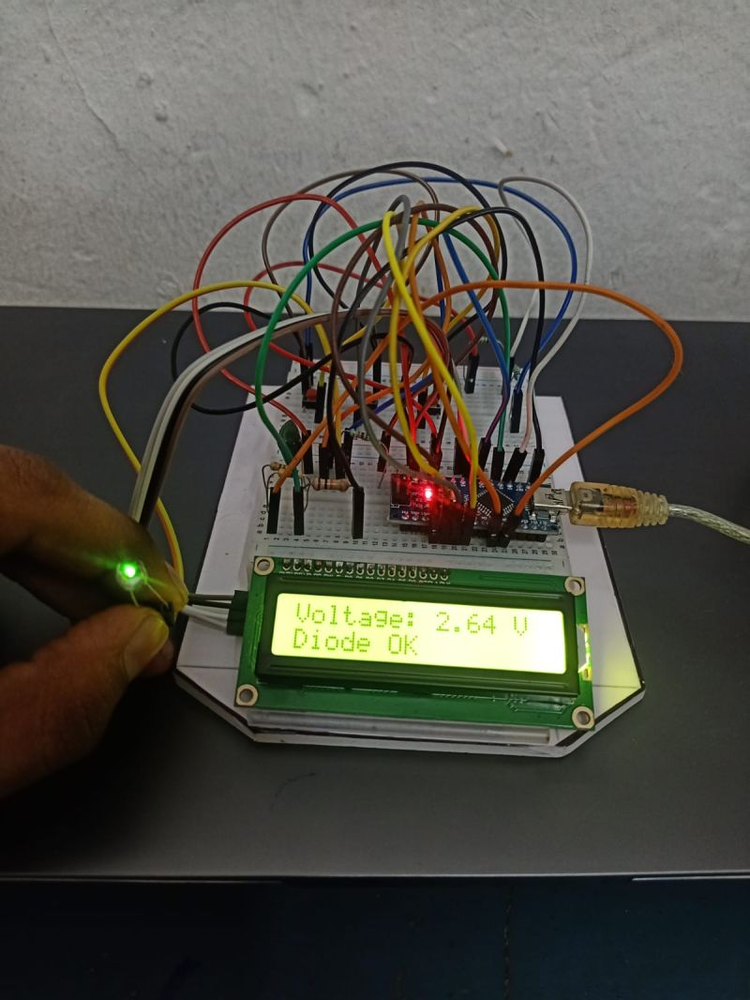

# Smart-Probe-Automated-Electronic-Component-Tester

##  Overview
The **Smart Probe** is an Arduino Nano-based testing device designed for the rapid, automated measurement and verification of basic electronic components. It efficiently tests resistors, capacitors, and diodes/LEDs, displaying the real-time calculated values and health status with a an accuracy of $\pm5\%$ on an I2C LCD screen. 

##  Features & Performance
The Smart Probe significantly reduces manual testing time while maintaining a high degree of accuracy (±5%).

| Component | Manual Testing Time | Smart Probe Time |
| :--- | :--- | :--- |
| **Resistor** | ~10 seconds | **~2 seconds** |
| **Capacitor** | ~20 to 30 seconds | **~3 to 4 seconds** |
| **Diode** | ~15 seconds | **~2 seconds** |

* **Multi-Component Testing:** Supports Resistors, Capacitors, and Diodes/LEDs automatically.
* **Hardware Debouncing:** Reliable mode selection using push buttons with software-defined debounce delays.
* **Custom PCB:** Includes a fully routed custom PCB design ready for fabrication.

##  Measurement Methodology
The Smart Probe leverages the Arduino's 10-bit Analog-to-Digital Converter (ADC), which maps voltages between 0 and 5V to integer values between 0 and 1023. By combining this with specific circuit topologies and timing functions, the system mathematically derives the component values.

### 1. Resistor Testing (Voltage Divider Method)
The system calculates unknown resistance using a classic voltage divider circuit paired with a precision $10\text{ k}\Omega$ reference resistor ($R_{known}$).
* **Mechanism:** The Arduino applies a 5V source ($V_{in}$) across the series resistors and reads the voltage drop at the junction via analog pin `A0`.
* **Math & Logic:** The raw ADC value is converted to the output voltage ($V_{out}$). The unknown resistance ($R_{unknown}$) is then calculated using the derived voltage divider formula:
  
  $$R_{unknown} = R_{known} \times \left(\frac{V_{in}}{V_{out}} - 1\right)$$

* **Edge Cases:** The code includes safeguards to detect open circuits (ADC = 0) to prevent division-by-zero errors.

### 2. Capacitor Testing (RC Time Constant Method)
Capacitance is determined by measuring the time it takes for the capacitor to charge through a known $10\text{ k}\Omega$ series resistor. 
* **Mechanism:** The Arduino sets the charge pin `HIGH` (5V) and simultaneously starts a high-resolution hardware timer using the `micros()` function.
* **Math & Logic:** In an RC circuit, it takes precisely one time constant ($\tau = R \times C$) for a capacitor to charge to $63.2\%$ of the supply voltage. 
    * $63.2\%$ of the maximum 10-bit ADC value (1023) is roughly **648**.
    * The system loops continuously until the analog pin reads an ADC value of 648.
    * Once reached, the elapsed time ($t$) is recorded, and capacitance ($C$) is calculated:

    $$C = \frac{t}{R_{known}}$$

* **Calibration:** The code applies a small mathematical offset ($-0.015\mu\text{F}$) to account for the stray capacitance of the breadboard and Arduino pins, ensuring higher accuracy.

### 3. Diode & LED Testing (Forward Voltage Drop)
This mode verifies the health and polarity of a diode by analyzing its behavior under a forward bias.
* **Mechanism:** A digital pin provides a 5V source to the component. The Arduino reads the resulting voltage at analog pin `A3`.
* **Math & Logic:** The raw ADC value is multiplied by the resolution factor `(5.0 / 1023.0)` to convert it to a real-world voltage. 
* **Evaluation:** The logic checks if the voltage falls within an expected functional window (between $2.3\text{V}$ and $3.0\text{V}$). If the voltage sits outside this window (or reads 0V), the system flags the component as either faulty, an open circuit, or inserted with the opposite polarity

##  Hardware Design & PCB
The hardware was designed to integrate the Arduino Nano directly onto a custom PCB alongside the testing terminals and mode-selection buttons. 

### Circuit Schematic

### 2D PCB Routing

### 3D PCB Render

* **Fabrication Files:** Complete Gerber files and drill data are available in the `hardware/` directory as `smart_probe_fabrication.zip`.

##  Functional Testing Gallery

### 1. Resistor Testing Mode

### 2. Capacitor Testing Mode

### 3. Diode & LED Testing Mode

##  How to Run the Code
1. Clone this repository to your local machine.
2. Navigate to the `src/` folder and open `fully_compiled_tester_code.ino` in the Arduino IDE.
3. Ensure you have the `LiquidCrystal_I2C` library installed.
4. Select **Arduino Nano** as your board and choose the correct COM port.
5. Compile and upload the code.
6. Press the hardware buttons to cycle between Resistor, Capacitor, and Diode testing modes.

---
